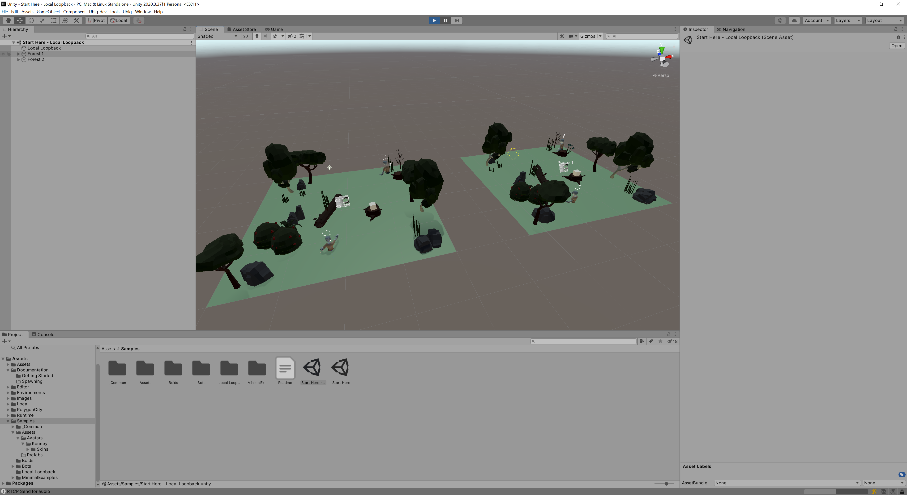

# Testing Networked Objects

A Local Loopback scene is included in the Ubiq Samples. Local loopback is helpful for testing your networked objects in only one copy of Unity. The scene contains two clients that join a new room when you enter Play Mode.

The scene is in the Samples folder (`Start Here - Local Loopback`). Click the play button to get started.

In the Scene View you should see two Avatars. One avatar is you - controlled via the Game View - and the other is Bot, which joins the other NetworkScene. 

Each environment is a separate Ubiq Peer. The script attached to the Local Loopback GameObject tells both instances to join the same Room. You can see on your in-game display the Join Code for this Room. Try and join it with a third Ubiq client and see what happens!

## Forests

Objects, such as Avatars and Spawned Items, are associated with a `NetworkScene`. They find their Network Scene by searching the Scene Graph for the closest one.

The Local Loopback scene has two Network Scenes, each under a top level GameObject, called a *Forest*. These GameObjects separate the Unity scene into branches, where all Components in one branch will find that branch's Network Scene.

You can add more Forests to the scene to create more Peers.

Only one Peer can be controlled by the PlayerController at any time however, since Unity only supports one set of Input Devices. The other Peers are controlled by Bots.

