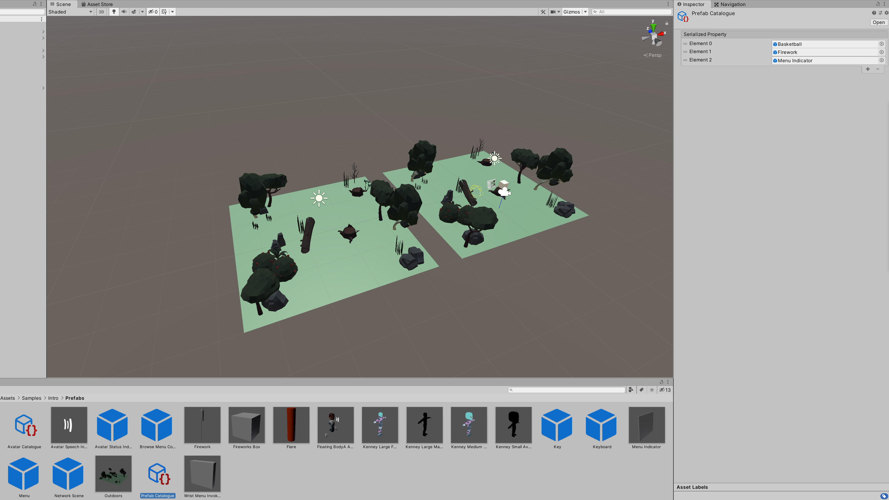

# Spawning Objects

You can create objects at runtime on all Peers using the `NetworkSpawner`.


Objects are spawned by calling `SpawnWithPeerScope()` or `SpawnWithRoomScope()`. The `NetworkSpawner` is static and so is accessible anywhere in the code. However, it needs a Unity `GameObject` to find the `NetworkScene` in which to spawn the object.

There are two Spawn methods: `SpawnWithPeerScope` and `SpawnWithRoomScope`.

* `SpawnWithPeerScope` keeps objects around so long as the Peer that spawned them is in the room.

* `SpawnWithRoomScope` keeps objects around so long as the room exists, regardless of who created them.

Rooms only exist as long as they have at least one member in them. Once all Peers leave a Room, the Room is destroyed along with all the objects within it.

Before a GameObject can be Spawned, it must be added to the `PrefabCatalogue` of the `SceneManager`.

Do this by adding a new entry to the `Prefab Catalogue` Asset in the Inspector. 



Once the Prefab GameObject has been added it can be spawned by passing the same reference to `SpawnWithPeerScope` or `SpawnWithRoomScope`:

```
public void Use(Hand controller)
{
	NetworkSpawnManager.Find(this).SpawnWithPeerScope(FireworkPrefab);
}
```

### Creating Spawnable Objects

When objects are spawned they need to be given the same network Id so they can communicate.

When objects are created at Design Time, this is done based on their position in the graph. When they are created at Runtime, they may not end up in the same position so this needs to be done explicitly.

When using the `NetworkSpawner`, Ids are assigned automatically, for every Network Object in the Prefab. For this to happen, Networked Objects must implement the `INetworkSpawnable` interface.

Update your networked object to use `Ubiq.Spawning`, then define `INetworkSpawnable` for your class. This interface requires you to have a property called NetworkId of the type NetworkId that can be read and written to. Create such a property with the default get and set accessors.

You don't have to do anything with the property - just have it in your class to satisfy `INetworkSpawnable`. Spawned instances of your object will now synchronise correctly.

```
using System.Collections;
using System.Collections.Generic;
using UnityEngine;
using Ubiq.Messaging;
using Ubiq.Spawning;

public class MyNetworkedObject : MonoBehaviour, INetworkSpawnable
{
    public NetworkId NetworkId { get; set; }

    NetworkContext context;

    // Start is called before the first frame update
    void Start()
    {
        context = NetworkScene.Register(this);
    }

    Vector3 lastPosition;

    // Update is called once per frame
    void Update()
    {
        if(lastPosition != transform.localPosition)
        {
            lastPosition = transform.localPosition;
            context.SendJson(new Message()
            {
                position = transform.localPosition
            });
        }
    }

    private struct Message
    {
        public Vector3 position;
    }

    public void ProcessMessage(ReferenceCountedSceneGraphMessage message)
    {
        // Parse the message
        var m = message.FromJson<Message>();

        // Use the message to update the Component
        transform.localPosition = m.position;

        // Make sure the logic in Update doesn't trigger as a result of this message
        lastPosition = transform.localPosition;
    }
}
```


Create a Prefab by dragging your Networked Object from the "Creating Networked Objects" tutorial into the Assets view, then add this to the Catalogue.